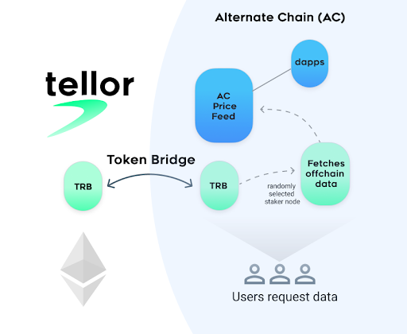

  

   

# Tellor Oracle Alternate Chain Structure (ACS)

## Overview   
Blockchains are closed systems that due to their consensus mechanisms cannot natively access off-chain data. If your smart contract relies on off-chain (e.g. internet or another chain) data to evaluate or execute a function, you either have to manually feed the data to your contract, incentivize users to do it, or rely on a centralized party to provide the data.

<b>The Tellor oracle</b> is a decentralized oracle. It provides an option for contracts to securely interact with and obtain data from off-chain. 

### Background 

On Ethereum, Tellor has implemented a network of staked PoW miners that compete to provide data and their stake can be slashed if they are deemed malicious. For more information about Tellor's implemetation on Ethereum check out our [documenation](https://tellor.readthedocs.io/en/latest/).

However, in order to support other chains, Tellor has developed an alternative chain structure (ACS) that works for both the security model of Tellor on Ethereum and on the alternate chain(s) as well.  In addition, the token economic model and utility of the current Tellor system is not compromised and only enhanced by the ability to support other chains.

Why not just deploy the current Tellor implementation in another chain?

1. Doing this would split PoW hashpower and decrease security.
2. Minting the "same" token in two chains is problematic since it would increase the inflation rate and keeping a healty token price relationship is difficult.
3. Tellor's current structure was specifically desinged with Ethereum's limitations and DeFi in mind. Alternate chains have different data demands and even different features (e.g. speed) that we can and should incorporate into the desing.

### Alternative Chain structure
The plan for alterate chains is to build a PoS Tellor system utilizing the Tellor Token and the current network of the Tellor community to validate and provide data on the alternate chain. The design assummes the alternate chain has:

* Functioning, Decentralized Token Bridge 
* On-chain smart contracts 

The following workflow describes the steps for the ACS:
* Tellor Token holders wishing to validate or request data on the alternate chain transfer tokens from Ethereum to the alternate chain.
* Validators stake Tellor Tokens in increments of 10 tokens
These ACS stakers are now randomly selected to provide data for given requests.
* There are 5 validators per data point. 
Parties pay for requests with TRB or native token to be split among validating stakers
* Minimum amount of TRB for each data point to be determined by cost on the network (cost for txn)
* Stakers are only rewarded if they fulfill the task, but if they miss their turn 5 times, they will lose a small amount of stake (e.g. 1 TRB per day) and are unstaked automatically after that.
* Values can be disputed
* Day long voting round initially, with additional dispute rounds (double the dispute fee and voting period each time)--Rounds are necessary to mitigate risk of flash voting. 
* Voting based upon balance on sidechain  at beginning of dispute (so you can bring over more Tellor for each subsequent dispute)

#### Maintainers  
[@themandalore](https://github.com/themandalore)
 
[@brendaloya](https://github.com/brendaloya) 

#### How to Contribute  
Join our Discord or Telegram:

Check out or issues log here on Github or contribute to our future plans to build a better miner and more examples of data secured by Tellor. 

#### Contributors

This repository is maintained by the Tellor team - [www.tellor.io](https://www.tellor.io)

#### Copyright

Tellor Inc. 2019
